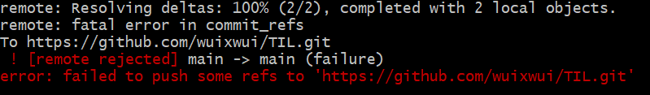

|    date    |    title     |  skill  |
| :--------: | :----------: | :-----: |
|  21.08.10  |  JavaScript  |   js    |

---

# TIL

1. 비구조화 할당

2. position의 위치 (z-index)

3. 문자열.repeat()

4. 배열 탐색

- array.includes(item)
- switch - case
- 객체를 이용한 검색 및 함수실행

---

분명 월요일도 TIL을 작성했었는데 파일도 보이지 않고 커밋도 없어서
내가 잘못 기억했나 싶었는데 오류가 발생했다.

구글링에 나오는 방법들을 다 사용해 봤는데 고쳐지지 않아서 결국 clone으로
깃헙에 있던 내용을 가져올 수 밖에 없었다..

열심히 커밋을 해야하는 이유가 생겼고
커밋을 올리고 제대로 확인해야겠다.
